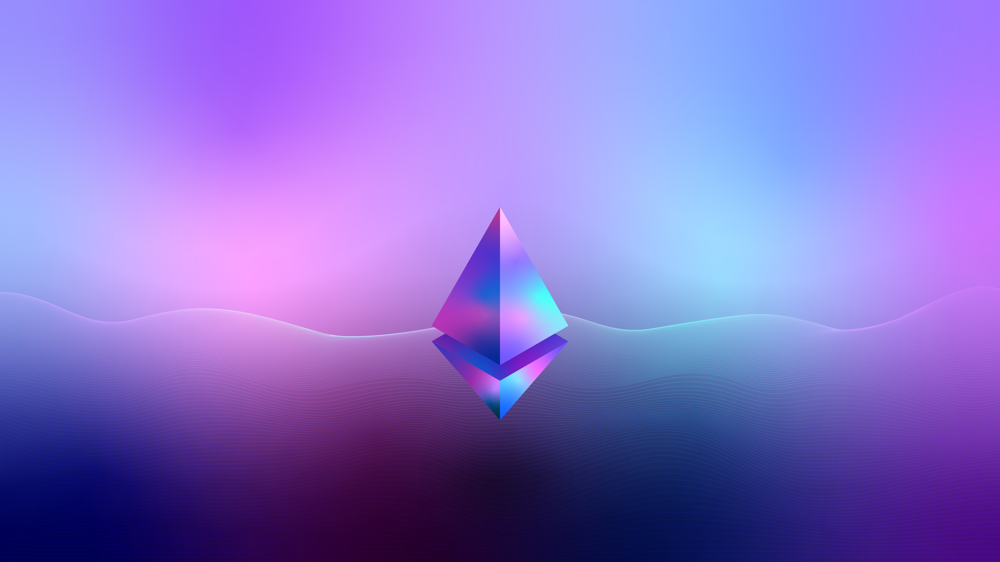

# Smart-Contract-With-React

Les smart contracts, ou contrats intelligents, sont des programmes informatiques irrévocables, le plus souvent déployés sur une blockchain, qui exécutent un ensemble d’instructions pré-définies.

L’idée maîtresse derrière ce concept de smart contracts est de garantir la force obligatoire des contrats non plus par le droit, mais directement par le code informatique : “code is law”, pour reprendre la célèbre formule de Lawrence Lessig.



Comme pour chaque programme informatique, la complexité est variable d’un contrat intelligent à l’autre. Certains implémentent des conditions simples, à l’image d’une fonction « si » Excel (si telle condition est remplie, alors le contrat est exécuté – “if this then that” pour les intimes) alors que d’autres smart contracts sont de véritables usines à gaz. A titre d’illustration, certains contrats intelligents ont même pour ambition de répliquer toutes les clauses et les règles permettant à des sociétés (commerciales ou non) de fonctionner. On parle souvent à ce propos de DAO, acronyme pour Organisation Autonome Décentralisée. Il est à noter que bien souvent, la complexité est l’ennemie de la sécurité.

## Technologies


## Comment ça marche ?
Pour utiliser votre contrat vous aurez besoin d'accéder au monde du Web3. Pour cela, le Web3 lui-même aura besoin d'un "Provider" (Fournisseur). Le provider fournit tout simplement au Web3 les ressources nécessaires (dont votre compte Metamask) pour qu'il puisse communiquer avec la Blockchain.

## Pour commencer

1 - Commencer par créer un wallet Metamask :
[Metamask](https://metamask.io/)

2 - Cloner/Forker le projet :
[Cloner un dépôt](https://docs.github.com/en/repositories/creating-and-managing-repositories/cloning-a-repository) /
[Forker un dépôt](https://docs.github.com/en/get-started/quickstart/fork-a-repo)

3 - Installer les dépendances des dossiers Front-Lottery et Solidity-Lottery via la commande :
```sh
npm i
```
4 - Créer un compte sur Infura (votre provider) et récupérer la clé API pour le réseau Goerli : [Infura](https://www.infura.io/)

5 - Créer dans le dossier Solidity-Lottery un fichier .env avec les variables contenues dans le fichier .env.example. Remplacez les valeurs.

6 - Placez-vous dans le dossier Solidity-Lottery et déployé votre contrat via la commande :
```sh
node deploy.js
```

7 - Après quelques secondes d'attente vous allez recevoir dans le terminal l'adresse sur laquel votre contrat a été déployé ainsi que votre ABI que vous pourrez aller copier dans le fichier lottery.js (Front-Lottery).

8 - Enfin, lancer le serveur via la commande
```sh
npm start
```

9 - Enjoy !
